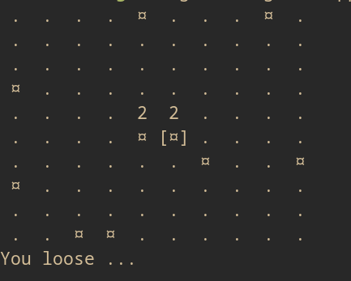

# Rust terminal minesweeper 



## Launch it
```console 
$ cargo run 10 10 10 # [rows] [cols] [bombs]
```

## Controls

| key                                                            | description        |
|----------------------------------------------------------------|--------------------|
| <kbd>UP</kbd>,<kbd>LEFT</kbd>,<kbd>DOWN</kbd>,<kbd>RIGHT</kbd> | Move cursor around |
| <kbd>SPACE</kbd>                                               | Open cell          |
| <kbd>f</kbd>                                                   | Flag/unflag cell   |
| <kbd>q</kbd>                                                   | Quit               |
